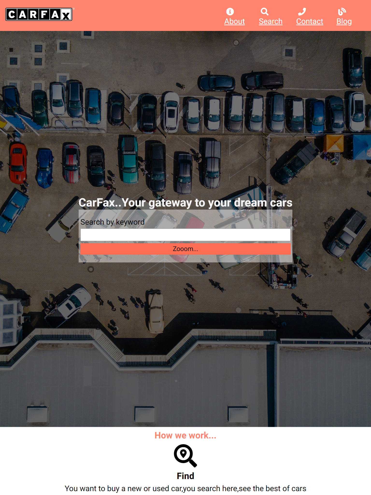

# CarFax clone

> Built for capstone project using HTML and SASS.This is a car selling website.
> made using Sass and HTML.

## Built With

- HTML
- Sass
## Live Demo

[Live Demo Link](https://iam-akshat.github.io/capstone-CarHub/src/)

## Authors

👤 **Akshat Sethi**

- GitHub: [@iam-Akshat](https://github.com/iam-Akshat)
- Twitter: [@akshatsethi](https://twitter.com/akshatsethi)
- LinkedIn: [LinkedIn](https://www.linkedin.com/in/akshat-sethi-786737ba/)

## 🤝 Contributing

Contributions, issues, and feature requests are welcome!

Feel free to check the [issues page](https://github.com/iam-Akshat/capstone-CarHub/issues).

## Show your support

Give a ⭐️ if you like this project!

## Acknowledgments

Design inspired from [Mathew Njuguna](https://www.behance.net/gallery/25563385/PatashuleKE)

## 📝 License

This project is [MIT](./lic.txt) licensed.
